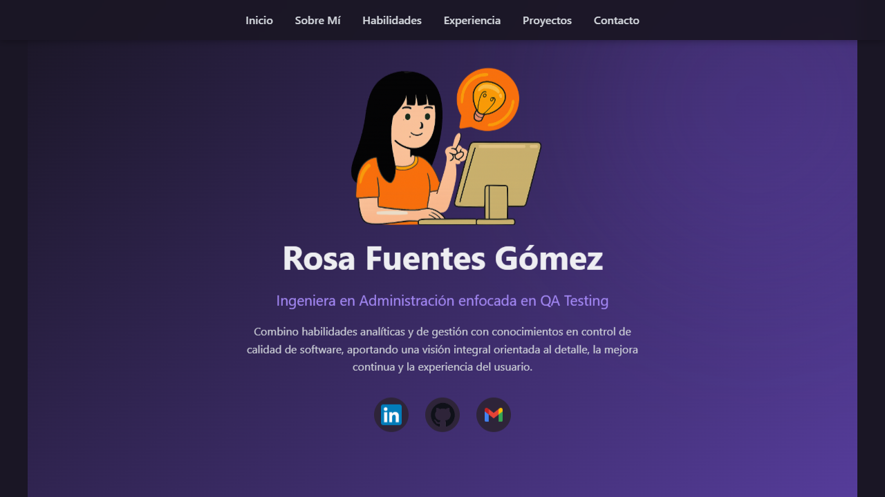

# Tests Automatizados E2E - Portafolio Rosa Fuentes

[](https://github.com/RosaFg/playwright-tests-portafolio)
[](https://github.com/RosaFg/playwright-tests-portafolio)
[](./BUGS_FOUND.md)
[](https://playwright.dev/)
[](https://www.python.org/)

Proyecto de testing automatizado E2E con Playwright + Python para validar mi portafolio web. Los tests detectaron 3 bugs reales en producción e incluyen un sistema completo de capturas de pantalla.

**URL del proyecto**: https://portafolio-rosafg.netlify.app/




---
## Resultados de Testing
| Métrica | Valor |
|---------|-------|
| **Tests totales** | 29 |
| **Tests pasando** | 25 (86%) |
| **Bugs encontrados** | 3 |
| **Cobertura de áreas** | 8 categorías |
| **Tiempo de ejecución** | ~33 segundos |

### Bugs Reales Encontrados
1. **CRÍTICO - Seguridad**: 6 enlaces externos sin `rel="noopener noreferrer"` (vulnerabilidad de tabnabbing)
2. **MEDIO - SEO**: Falta meta description (afecta posicionamiento en buscadores)
3. **MEDIO - SEO**: Falta favicon (afecta identidad visual)

**Ver detalle completo**: [BUGS_FOUND.md](./BUGS_FOUND.md)

## Categorías de Tests
### 1. Tests Funcionales (8 tests)
Validan la funcionalidad básica de la página.

- Carga de página principal
- Título correcto
- Elementos UI visibles
- Navegación interna

**Archivos**: `test_home.py`, `test_ui_elements.py`

### 2. Tests de Formulario (5 tests)
Verifican el comportamiento del formulario de contacto.

- Campos del formulario presentes
- Llenado de campos
- Botón de envío clickeable
- Validación de tipo email
- Campos requeridos marcados

**Archivos**: `test_contact_form.py`, `test_forms_validation.py`

### 3. Tests de Enlaces (4 tests)
Validan la integridad y seguridad de enlaces.

- Enlaces a GitHub válidos
- Enlaces externos abren en nueva pestaña
- No hay enlaces internos rotos
- **BUG ENCONTRADO**: Enlaces sin protección de seguridad

**Archivos**: `test_links.py`, `test_broken_links.py`

### 4. Tests Responsive (3 tests)
Verifican diseño adaptativo en diferentes dispositivos.

- Diseño móvil (375x812)
- Diseño tablet (768x1024)
- Diseño desktop (1920x1080)

**Archivo**: `test_responsive.py`

### 5. Tests de Accesibilidad (4 tests)
Validan cumplimiento de estándares WCAG 2.1.

- Imágenes con atributo alt
- Atributo lang en HTML
- Jerarquía de headings correcta
- Texto descriptivo en enlaces

**Archivos**: `test_accessibility.py`, `test_contrast_accessibility.py`

### 6. Tests de Performance (2 tests)
Miden rendimiento y detectan errores.

- Tiempo de carga menor a 2 segundos
- Sin errores en consola

**Archivos**: `test_performance.py`, `test_contact_form.py`

### 7. Tests de SEO (3 tests)
Verifican optimización para motores de búsqueda.

- **BUG ENCONTRADO**: Falta meta description
- Meta keywords presente
- **BUG ENCONTRADO**: Falta favicon

**Archivo**: `test_seo.py`

### 8. Tests de Usabilidad Móvil (3 tests)
Validan experiencia de usuario en dispositivos móviles.

- Viewport meta tag configurado
- Texto legible en móvil (mayor o igual a 14px)
- Botones touch-friendly (mayor o igual a 44px)

**Archivo**: `test_mobile_usability.py`

---

## Sistema de Capturas de Pantalla

### Características
1. **Screenshots automáticos en fallos**: Captura automática cuando un test falla
2. **Screenshots manuales**: Tests específicos para documentación visual
3. **Screenshots responsive**: Capturas en móvil, tablet y desktop
4. **Screenshots de elementos**: Captura elementos específicos (header, footer, etc.)
5. **Comparación visual**: Detecta cambios visuales entre versiones (regresión visual)

### Tipos de screenshots
#### 1. Screenshots automáticos (en fallos)
Configurados en `conftest.py`, se capturan automáticamente cuando un test falla.

```bash
# Ejecutar tests normalmente
pytest

# Si un test falla, se guarda automáticamente:
# screenshots/test_has_meta_description_20251115_143052_FAILED.png
```

#### 2. Screenshots manuales (documentación)
Tests específicos que capturan screenshots para documentación.

```bash
# Ejecutar tests de screenshots manuales
pytest tests/test_screenshots_manual.py -v

# Genera:
# - 01_home_full_page_*.png
# - 02_home_viewport_*.png
# - 08_mobile_375x812_*.png
# - etc.
```

#### 3. Comparación visual (regresión)
Detecta cambios visuales comparando con baseline.

```bash
# Primera ejecución: crea baseline
pytest tests/test_visual_comparison.py

# Ejecuciones posteriores: compara con baseline
pytest tests/test_visual_comparison.py
```

### Comandos útiles para screenshots
```bash
# Ver todos los screenshots
dir screenshots\              # Windows
ls screenshots/               # Mac/Linux

# Ver solo screenshots de fallos
dir screenshots\*FAILED.png   # Windows
ls screenshots/*FAILED.png    # Mac/Linux

# Limpiar screenshots antiguos
del screenshots\*.png         # Windows
rm screenshots/*.png          # Mac/Linux

# Ver baseline
dir screenshots\baseline\     # Windows
ls screenshots/baseline/      # Mac/Linux
```

### Configuración de screenshots
En `pytest.ini`:
```ini
[pytest]
addopts = 
    --screenshot=only-on-failure  # Solo capturar en fallos
    --video=retain-on-failure     # Grabar video en fallos
```

Opciones disponibles:
- `--screenshot=on`: Siempre capturar
- `--screenshot=only-on-failure`: Solo en fallos (recomendado)
- `--screenshot=off`: Nunca capturar

---

## Ejemplo de Salida
```bash
$ pytest -v

========================= test session starts =========================
platform win32 -- Python 3.13.0, pytest-8.4.2, pluggy-1.6.0
rootdir: C:\Users\PC uwu\Desktop\Proyectos\Proyecto
configfile: pytest.ini
testpaths: tests
plugins: base-url-2.1.0, playwright-0.7.1
collected 29 items

tests/test_accessibility.py::test_images_have_alt PASSED        [  3%]
tests/test_accessibility.py::test_page_has_lang_attribute PASSED[  6%]
tests/test_broken_links.py::test_no_broken_internal_links PASSED[ 10%]
tests/test_broken_links.py::test_external_links_have_security FAILED [ 13%]

Screenshot guardado: screenshots/test_external_links_have_security_20251115_143052_FAILED.png

tests/test_contact_form.py::test_contact_form_elements PASSED   [ 17%]
tests/test_seo.py::test_has_meta_description FAILED             [ 86%]

Screenshot guardado: screenshots/test_has_meta_description_20251115_143110_FAILED.png

tests/test_seo.py::test_has_favicon FAILED                      [ 93%]

Screenshot guardado: screenshots/test_has_favicon_20251115_143115_FAILED.png

==================== 25 passed, 3 failed in 33.04s ===================
```
---

## Comandos de Ejecución
### Comandos básicos
```bash
# Ejecutar todos los tests
pytest

# Ejecutar con output detallado
pytest -v

# Ejecutar con output muy detallado
pytest -vv

# Ejecutar con navegador visible
pytest --headed
```

### Ejecutar tests específicos
```bash
# Por archivo
pytest tests/test_seo.py
pytest tests/test_accessibility.py

# Por categoría usando marcadores
pytest -m smoke
pytest -m accessibility
pytest -m performance

# Por nombre de test
pytest -k "test_github_link"

# Tests de screenshots manuales
pytest tests/test_screenshots_manual.py -v
```

### Generar reportes
```bash
# Reporte HTML
pytest --html=report.html --self-contained-html

# Reporte con captura de pantalla en fallos
pytest --screenshot=only-on-failure

# Ver screenshots generados
dir screenshots\     # Windows
ls screenshots/      # Mac/Linux
```

### Opciones de navegador
```bash
# Firefox (por defecto)
pytest

# Chromium
pytest --browser chromium

# WebKit (Safari)
pytest --browser webkit

# Múltiples navegadores
pytest --browser firefox --browser chromium
```
---
## Integración Continua (CI/CD)
Este proyecto incluye GitHub Actions para ejecutar tests automáticamente:

- Cada push a `main`
- Cada pull request
- Diariamente a las 9 AM UTC
- Manualmente desde la interfaz de GitHub

**Ver configuración**: [.github/workflows/tests.yml](.github/workflows/tests.yml)

### Artifacts generados por CI/CD:
- Reporte HTML de tests
- Screenshots de tests fallidos
- Videos de tests fallidos
- Logs de ejecución

---
## Estructura del Proyecto
```
playwright-tests-portafolio/
│
├── tests/                              # Suite de tests
│   ├── test_accessibility.py           # Tests de accesibilidad
│   ├── test_broken_links.py            # Detección de enlaces rotos y seguridad
│   ├── test_contact_form.py            # Validación de formulario
│   ├── test_contrast_accessibility.py  # Contraste y jerarquía visual
│   ├── test_forms_validation.py        # Validación de campos
│   ├── test_home.py                    # Página principal
│   ├── test_links.py                   # Enlaces y navegación
│   ├── test_mobile_usability.py        # Usabilidad móvil
│   ├── test_performance.py             # Rendimiento
│   ├── test_responsive.py              # Diseño responsive
│   ├── test_seo.py                     # Optimización SEO
│   ├── test_ui_elements.py             # Elementos de interfaz
│   ├── test_screenshots_manual.py      # Tests con capturas manuales
│   └── test_visual_comparison.py       # Comparación visual (regresión)
│
├── screenshots/                         # Capturas de pantalla
│   ├── baseline/                        # Screenshots de referencia
│   ├── comparison/                      # Screenshots actuales
│   └── *.png                            # Screenshots con timestamp
│
├── .github/workflows/
│   └── tests.yml                        # CI/CD con GitHub Actions
│
├── conftest.py                          # Configuración de pytest + screenshots
├── pytest.ini                           # Configuración de ejecución
├── requirements.txt                     # Dependencias del proyecto
├── .gitignore                           # Archivos ignorados
├── README.md                            # Este archivo
├── BUGS_FOUND.md                        # Documentación de bugs
├── LICENSE                              # Licencia MIT
└── report.html                          # Reporte generado (opcional)
```

## Tecnologías Utilizadas
- **Python** 3.13.0
- **Playwright** 1.40.0
- **Pytest** 8.4.2
- **pytest-playwright** 0.7.1
- **pytest-html** 4.1.1
- **Pillow** 10.1.0 (para comparación visual)
- **Firefox** (navegador principal)

---
## Instalación Rápida

### Requisitos previos
- Python 3.10 o superior
- pip (gestor de paquetes de Python)

### Pasos de instalación
```bash
# 1. Clonar el repositorio
git clone https://github.com/RosaFg/playwright-tests-portafolio.git
cd playwright-tests-portafolio

# 2. Crear entorno virtual
python -m venv .venv

# 3. Activar entorno virtual
# En Windows:
.venv\Scripts\activate

# En Mac/Linux:
source .venv/bin/activate

# 4. Instalar dependencias
pip install -r requirements.txt

# 5. Instalar navegadores de Playwright
playwright install firefox

# 6. Ejecutar tests
pytest
```
---
## Buenas Prácticas Implementadas
**Organización**
- Tests independientes y aislados
- Nombres descriptivos siguiendo convención `test_*`
- Estructura clara por categorías
- Documentación completa

**Mantenibilidad**
- Configuración centralizada en `conftest.py` y `pytest.ini`
- Fixtures reutilizables de pytest-playwright
- Código limpio y documentado
- Sistema de screenshots automatizado

**Confiabilidad**
- Esperas explícitas con `expect()`
- Manejo de errores y timeouts
- Tests determinísticos
- Capturas automáticas en fallos

**Escalabilidad**
- Fácil agregar nuevos tests
- Soporta múltiples navegadores
- Integración con CI/CD
- Sistema de comparación visual

---

## Troubleshooting
### Error: "Browser not found"
```bash
playwright install firefox
```

### Error: "Module 'pytest' not found"
```bash
pip install -r requirements.txt
```

### Error: "Module 'PIL' not found" (para comparación visual)
```bash
pip install Pillow
```

### Tests muy lentos
Ejecuta en modo headless (sin interfaz gráfica):
```bash
pytest  # headless por defecto
```

### Ver navegador durante ejecución
```bash
pytest --headed
```

### Depurar un test específico
```bash
pytest tests/test_seo.py::test_has_meta_description -v -s
```

### No se generan screenshots
Verifica que existe `conftest.py` en la raíz del proyecto y que la carpeta `screenshots/` se creó automáticamente.

### Screenshots no se suben a Git
Por defecto, los screenshots se ignoran en `.gitignore` excepto los baseline. Para incluirlos, comenta estas líneas en `.gitignore`:
```
# screenshots/*.png
# screenshots/comparison/
```

---

## Recursos y Referencias
- [Documentación de Playwright Python](https://playwright.dev/python/)
- [Documentación de Pytest](https://docs.pytest.org/)
- [Guía de Testing E2E](https://martinfowler.com/articles/practical-test-pyramid.html)
- [WCAG 2.1 Accessibility Guidelines](https://www.w3.org/WAI/WCAG21/quickref/)
- [Web Security - Tabnabbing](https://owasp.org/www-community/attacks/Reverse_Tabnabbing)
- [Visual Regression Testing](https://github.com/mapbox/pixelmatch)

---
## Changelog

### [1.0.0] - 2025-11-15

#### Añadido
- Suite completa de 29 tests E2E
- Tests de accesibilidad (WCAG 2.1)
- Tests de SEO
- Tests de seguridad en enlaces
- Tests responsive (mobile, tablet, desktop)
- Tests de performance
- Sistema completo de capturas de pantalla
  - Screenshots automáticos en fallos
  - Screenshots manuales para documentación
  - Screenshots responsive
  - Comparación visual (regresión)
- Documentación de bugs encontrados
- CI/CD con GitHub Actions
- Generación de reportes HTML

#### Bugs detectados
- Enlaces externos sin `rel="noopener noreferrer"`
- Falta de meta description
- Falta de favicon

---

## Autora

**Rosa Fuentes**  
*QA Automation Engineer*

- **Portfolio**: https://portafolio-rosafg.netlify.app/
- **LinkedIn**: [linkedin.com/in/rosafg](https://www.linkedin.com/in/rosafg/)
- **GitHub**: [@RosaFg](https://github.com/RosaFg)
- **Email**: rosafuegos@gmail.com

---

## Licencia

Este proyecto está bajo la Licencia MIT. Ver el archivo [LICENSE](LICENSE) para más detalles.

**Hecho por Rosa Fuentes - Automatizando el testing, un test a la vez**